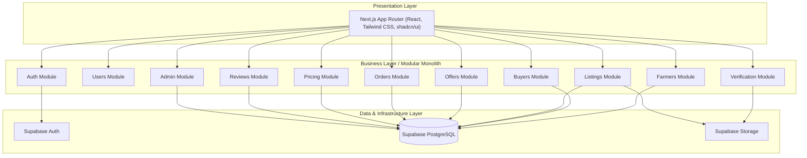

# KrishiSetu 🌾

**Smart Agricultural Procurement & Marketplace Platform**

Connecting Farmers with Verified Buyers through Transparent Pricing and Direct Procurement.

KrishiSetu is a digital marketplace designed to eliminate middlemen by directly connecting verified small and medium-scale farmers with verified business buyers (traders, retailers, kirana stores, restaurants, and wholesalers).

```text
Discover  ──►  Compare  ──►  Negotiate  ──►  Purchase  ──►  Pickup
```

---

## 📌 Problem Statement

Small and medium-scale agricultural producers face recurring systemic challenges:

* **Intermediary Dependency:** Heavy reliance on local commission agents and traders leads to diminished profit margins for farmers.
* **Price Opacity:** Absence of accessible, real-time market price benchmarks (APMC/MSP) leads to exploitation.
* **Uncertain Demand:** Farmers struggle to connect directly with bulk commercial buyers prior to harvest.
* **Procurement Inefficiencies:** Buyers struggle to locate consistent, reliable agricultural suppliers with verified quality produce.
* **Fragmented Comparison:** Lack of a centralized platform to evaluate produce availability, location, and pricing.

---

## 💡 Solution

KrishiSetu provides an end-to-end digital procurement ecosystem featuring:

* **Direct Marketplace:** Direct farmer-to-buyer trade without commission agents.
* **Verified Profiles:** Identity and credential verification for both farmers and commercial buyers.
* **Structured Crop Listings:** Clear specifications of quantity, quality grade, asking price, harvest dates, and pickup locations.
* **Smart Price Benchmarking:** Instant visibility of local APMC rates and Government Minimum Support Prices (MSP) alongside farmer asking prices.
* **Flexible Purchase Options:** Support for instant purchase (**Buy Now**) and price negotiations (**Make Offer**).
* **Order Management & Tracking:** Clear status tracking from order confirmation through self-arranged buyer pickup.
* **Trust & Reputation System:** Transparent user ratings and reviews following order completion.

---

## 🎯 Objectives

* **Direct Trade Access:** Establish a reliable digital venue for direct farmer-to-buyer transactions.
* **Enhanced Price Transparency:** Integrate official APMC market rates and MSP references to empower informed trade.
* **Reduce Intermediaries:** Eliminate unnecessary layers in the supply chain to maximize farmer returns and reduce buyer costs.
* **Verified Ecosystem:** Build trust using administrative verification for marketplace participants.
* **Digital Record-Keeping:** Digitize procurement transactions, negotiations, and historical sales records.

---

## ✨ Key Features

### 🚜 Farmer Capabilities
* **Account Management:** User registration, profile setup, and identity verification submission.
* **Listing Creation:** Post crop listings specifying category, quantity, quality grade, asking price, location, and photos.
* **Offer Negotiation:** Receive, review, accept, or reject custom price and quantity offers submitted by buyers.
* **Order Tracking:** Manage order statuses from confirmation to buyer pickup.
* **Sales Analytics & History:** View completed sales, revenue records, and buyer feedback.

### 🛍️ Buyer Capabilities
* **Browse & Search:** Search agricultural listings with filters for crop type, location, quantity, price range, and seller rating.
* **Market Price Reference:** View relevant APMC rates and Minimum Support Prices (MSP) directly on listing detail pages.
* **Instant Procurement (Buy Now):** Place direct orders at the farmer's asking price.
* **Negotiation (Make Offer):** Propose custom unit price and quantity offers to farmers.
* **Order Lifecycle Management:** Track confirmed orders, coordinate self-arranged transport, and confirm produce pickup.
* **Seller Reviews:** Submit ratings and qualitative feedback upon order completion.

### 🛡️ Admin Capabilities
* **User Verification:** Review and approve farmer and buyer registration credentials.
* **Content Moderation:** Monitor and approve crop listings to ensure marketplace quality standards.
* **Market Rate Updates:** Maintain and update benchmark APMC reference rates and MSP values.
* **Dispute & Order Oversight:** Monitor transactions and assist in dispute resolution.
* **Marketplace Overview:** Access basic system analytics (active users, total listings, completed orders).

---

## 🏷️ Pricing System

KrishiSetu equips buyers and farmers with a **Smart Price Indicator** that dynamically evaluates listing prices against market benchmarks using rule-based metrics:

| Indicator | Classification | Description |
| :--- | :--- | :--- |
| 🟢 **Fair Price** | Market Aligned | Farmer asking price closely matches prevailing APMC market rates. |
| 🟡 **Below Market** | High Value | Farmer asking price is below prevailing APMC market rates. |
| 🔴 **Above Market** | Premium Pricing | Farmer asking price exceeds prevailing APMC market rates (often reflecting premium quality). |

> ℹ️ *Note: The current MVP utilizes rule-based numerical comparisons against static/updated APMC database records.*

---

## 🔄 Workflows

### 🛒 Order Workflow (Buyer Pickup Model)

```text
┌─────────────────────────┐
│ Buy Now / Accepted Offer│
└────────────┬────────────┘
             │
             ▼
┌─────────────────────────┐
│     Order Confirmed     │
└────────────┬────────────┘
             │
             ▼
┌─────────────────────────┐
│ Buyer Arranges Transport│
└────────────┬────────────┘
             │
             ▼
┌─────────────────────────┐
│  Buyer Pickup at Farm   │
└────────────┬────────────┘
             │
             ▼
┌─────────────────────────┐
│     Order Completed     │
└────────────┬────────────┘
             │
             ▼
┌─────────────────────────┐
│     Rating & Review     │
└─────────────────────────┘
```

> 📌 *Note: The current MVP operates on a **Buyer Pickup Model** where transport and logistics are arranged directly by the buyer.*

### 🤝 Offer Workflow (Negotiation)

```text
┌─────────────────────────┐
│   Buyer Selects Crop    │
└────────────┬────────────┘
             │
             ▼
┌─────────────────────────┐
│ Submits Price & Quantity│
└────────────┬────────────┘
             │
             ▼
┌─────────────────────────┐
│  Farmer Reviews Offer   │
└────────────┬────────────┘
             │
      ┌──────┴──────┐
      ▼             ▼
  [ Accept ]   [ Reject ]
      │             │
      ▼             ▼
 Order Created   Offer Ended
```

---

## 🏗️ System Architecture

KrishiSetu is structured as a **Modular Monolith** adhering to a **Three-Layer Architecture**. All business domains are logically encapsulated into distinct modules within a single codebase to balance rapid development with clean architectural boundaries.



---

## 🛠️ Technology Stack

| Layer | Technology | Description |
| :--- | :--- | :--- |
| **Frontend Framework** | Next.js / React | App Router, Server Actions, Client Components |
| **Language** | TypeScript | End-to-end static type safety |
| **Styling & UI** | Tailwind CSS / shadcn/ui | Utility-first styling with accessible UI components |
| **Backend Logic** | Next.js Server Actions / API Routes | Server-side business logic and route handlers |
| **Database** | Supabase PostgreSQL | Relational database storage |
| **Authentication** | Supabase Auth | User authentication and JWT management |
| **Storage** | Supabase Storage | Image uploads for listings and verification documents |
| **Data Visualization**| Recharts | Charts and dashboard analytics |
| **Deployment** | Vercel | Application hosting and continuous deployment |

---

## 🗄️ Database Schema Overview

The underlying Supabase PostgreSQL database consists of the following primary tables:

* `users` — Core user identity, role assignments (`farmer`, `buyer`, `admin`), and timestamps.
* `farmer_profiles` — Extended farmer attributes (farm location, land size, verification status).
* `buyer_profiles` — Commercial buyer details (business name, GST/license info, procurement preferences).
* `listings` — Agricultural crop postings (crop type, quantity, asking price, location, status).
* `offers` — Negotiation records submitted by buyers for specific listings.
* `orders` — Binding purchase records generated via "Buy Now" or accepted offers.
* `order_status_history` — Audit trail for order state transitions.
* `reviews` — Post-fulfillment rating scores and feedback.
* `market_prices` — APMC market prices and Government MSP reference data.
* `notifications` — In-app user notifications for offer updates, verification, and order milestones.

### Key Entity Relationships
* `users` ─── *(1:1)* ───► `farmer_profiles` / `buyer_profiles`
* `farmer_profiles` ─── *(1:N)* ───► `listings`
* `listings` ─── *(1:N)* ───► `offers`
* `listings` ─── *(1:N)* ───► `orders`
* `orders` ─── *(1:1)* ───► `reviews`
* `orders` ─── *(1:N)* ───► `order_status_history`

---

## 📁 Project Structure

```text
krishisetu/
├── public/                # Static public assets
├── src/
│   ├── app/               # Next.js App Router pages and layouts
│   ├── components/        # Shared UI components (shadcn/ui, layout)
│   ├── config/            # Application configuration and constants
│   ├── lib/               # Utility functions, Supabase clients, helpers
│   ├── modules/           # Domain-driven feature modules
│   │   ├── admin/         # Admin verification and moderation
│   │   ├── auth/          # Authentication flows and guards
│   │   ├── buyers/        # Buyer profiles and workflows
│   │   ├── farmers/       # Farmer profiles and listings management
│   │   ├── listings/      # Crop discovery, filtering, detail views
│   │   ├── offers/        # Price negotiation handling
│   │   ├── orders/        # Order creation and status tracking
│   │   ├── pricing/       # APMC/MSP reference price calculation
│   │   ├── reviews/       # Rating and review processing
│   │   ├── users/         # Core user management
│   │   └── verification/  # Document verification engine
│   └── types/             # TypeScript type definitions and DB models
├── supabase/              # Supabase migrations and seed scripts
├── .env.example           # Environment template file
├── package.json           # Node project configuration and dependencies
└── tsconfig.json          # TypeScript configuration
```

---

## 🔒 Security Measures

* **Authentication:** Managed securely via Supabase Auth using JWT sessions.
* **Role-Based Access Control (RBAC):** Strict policy checks ensuring Farmers, Buyers, and Admins can only perform permitted operations.
* **Row-Level Security (RLS):** Enabled on PostgreSQL tables so users can only view or mutate authorized data.
* **Server-Side Validation:** All inputs validated via Server Actions / API routes before executing database operations.
* **Secret Protection:** Sensitive keys maintained strictly in server-side environment variables.

---

## 🚀 Getting Started

### Prerequisites

* **Node.js** (v18.0.0 or higher recommended)
* **npm** (v9.0.0 or higher)
* A **Supabase** project instance (for Auth, Database, and Storage)

### Installation

1. **Clone the repository:**
   ```bash
   git clone <repository-url>
   cd krishisetu
   ```

2. **Install dependencies:**
   ```bash
   npm install
   ```

3. **Configure Environment Variables:**
   Create a `.env.local` file in the root of the `krishisetu` directory by copying `.env.example`:
   ```bash
   cp .env.example .env.local
   ```
   Add your Supabase credentials:
   ```env
   NEXT_PUBLIC_SUPABASE_URL=your_supabase_project_url
   NEXT_PUBLIC_SUPABASE_ANON_KEY=your_supabase_anon_key
   ```

4. **Run the Development Server:**
   ```bash
   npm run dev
   ```

5. **Access the application:**
   Open [http://localhost:3000](http://localhost:3000) in your web browser.

---

## ☁️ Deployment

KrishiSetu is designed for seamless deployment on **Vercel** connected to **Supabase**:

```text
GitHub Repository ──► Vercel (Next.js Application) ──► Supabase (Auth, DB, Storage)
```

---

## 📊 Current MVP Scope (15-Day College Project)

The current working implementation includes:

* [x] Farmer Registration & Profile Setup
* [x] Buyer Registration & Profile Setup
* [x] Admin Profile & Verification Workflow
* [x] Crop Listing Creation & Management
* [x] Marketplace Search & Filtering
* [x] APMC / MSP Reference Price Benchmarking
* [x] Buy Now Direct Ordering
* [x] Make Offer Price Negotiation System
* [x] Order Status Management & Pickup Tracking
* [x] Post-Order Ratings & Review System

---

## 🚀 Future Scope (Post-MVP Roadmap)

> ⚠️ *The following features are planned for future iterations and are **NOT part of the current 15-day MVP**:*

* **Integrated Online Payments:** Escalation to UPI / Payment Gateways with Escrow mechanism.
* **Third-Party Logistics Integration:** Automated transport booking and vehicle matching.
* **AI Price Prediction Engine:** Machine learning models forecasting seasonal APMC price trends.
* **AI Crop Recommendation:** Agronomic advisories based on soil and climate data.
* **Multilingual Voice Assistant:** Voice-enabled accessibility for regional rural farmers.
* **Weather & Advisory Alerts:** Hyperlocal weather integration.
* **Contract Farming Modules:** Pre-harvest agreement frameworks.

---

## 📐 Development Philosophy

**Simple to Build Now • Modular by Design • Scalable for the Future**

KrishiSetu intentionally adopts a **Modular Monolith** architecture instead of microservices. For a 15-day MVP, a modular monolith minimizes deployment complexity, avoids distributed system overhead, and ensures rapid iteration while maintaining strict module encapsulation. This allows future microservice extraction if scale demands it.

---

## 👥 Team

- **Name** — Role
- **Name** — Role
- **Name** — Role

---

## 🎓 Academic Context

KrishiSetu was developed as a 15-day **BSc Computer Science Final Year Project** focusing on applying web architecture, relational database design, and domain-driven modular patterns to solve real-world agricultural supply chain problems.

---

## 📄 License

License information will be added when finalized by the project team.
